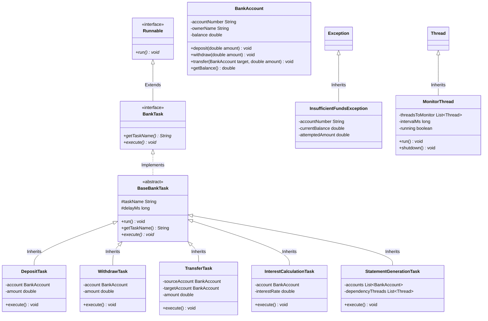
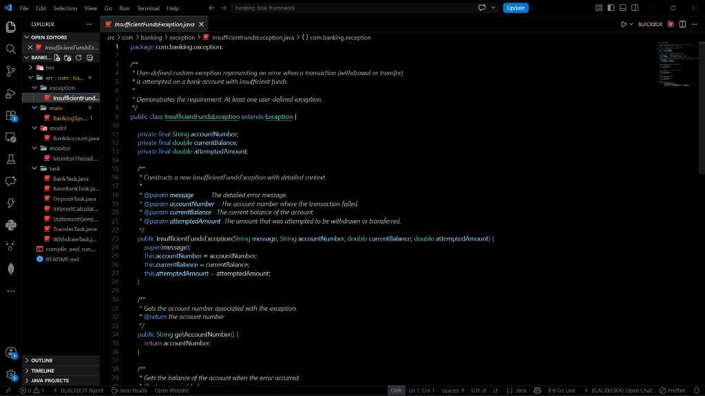
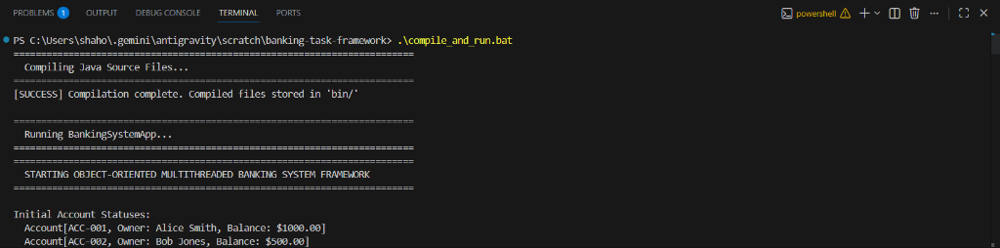
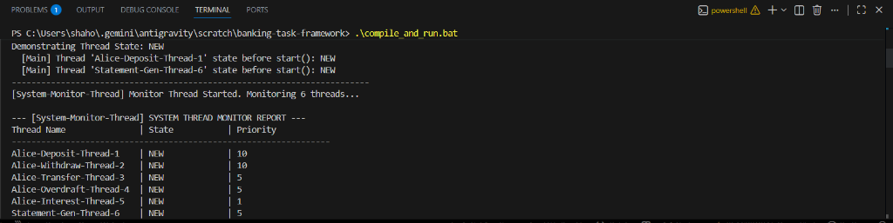
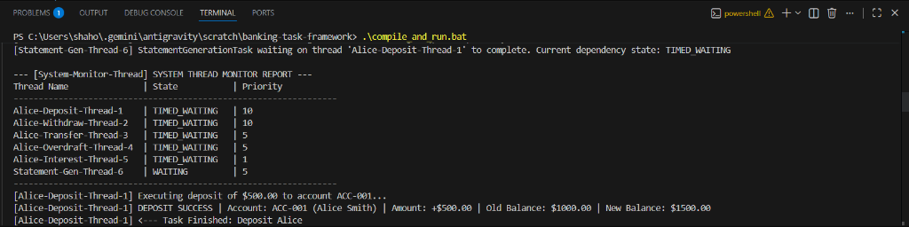
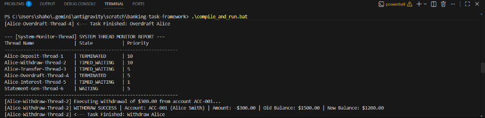
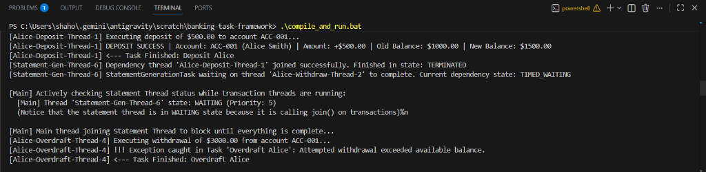
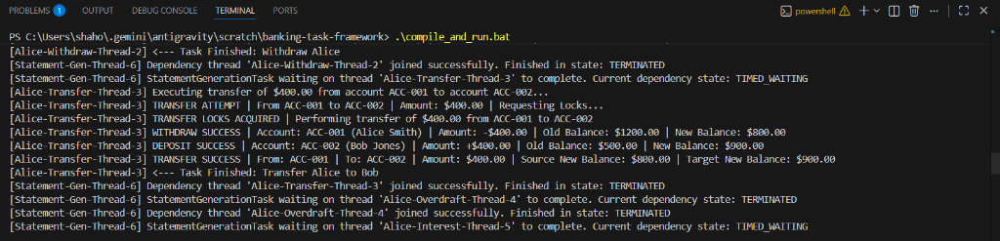
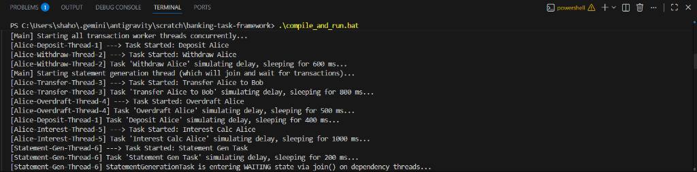
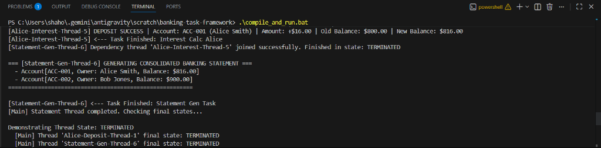

# Object Oriented Programming with Java: Mini Project Report
**Topic:** Generic Multithreaded Task Management Framework (Banking System Domain)

<div style="page-break-before: always; break-before: page;"></div>

## 1. Introduction
Modern software systems require high levels of concurrency to maintain responsiveness and throughput. In financial applications, concurrency is crucial to allow multiple users to deposit, withdraw, transfer funds, calculate interest, and generate statements simultaneously. 

This project delivers a **Generic Multithreaded Task Management Framework** implemented in Java. Operating within the **Banking System** domain, the application demonstrates how multiple transaction tasks are scheduled, run concurrently, synchronized to prevent race conditions, and monitored across their lifecycles.

### Concurrency and Process-Level vs. Thread-Level Execution
In modern computer architecture, maximizing throughput and system efficiency requires concurrent execution. Concurrency is the ability to run multiple tasks, programs, or transactions in overlapping time frames. Broadly, concurrency is achieved at two levels:
* **Process-Level Concurrency (Multitasking)**: Operating systems execute multiple independent processes (programs) simultaneously. Each process operates within its own dedicated virtual memory space, isolated from other processes. Communication between them requires expensive Inter-Process Communication (IPC) protocols.
* **Thread-Level Concurrency (Multithreading)**: A single process spawns multiple execution units called threads. Unlike processes, threads belonging to the same process share the same memory space, code segments, and heap allocation. This shared-memory model enables extremely fast data sharing and context switching, as threads do not need to switch memory contexts.

### Concurrency in the Financial Domain
In financial architectures, concurrency is not merely a performance optimizer; it is a core business requirement. A banking system must process thousands of concurrent operations—such as deposits, balance checks, withdrawals, transfers, interest accruals, and statement generation—from web services, ATMs, and internal batch processors. 

However, because threads share memory, concurrent updates to shared variables (like a bank account balance) can introduce critical risks, including race conditions, data corruption, and deadlocks. To prevent these risks, financial systems must adhere strictly to the **ACID** properties:
1. **Atomicity**: A transaction must occur completely or not at all (e.g., a transfer must withdraw from Account A and deposit in Account B; it cannot fail halfway).
2. **Consistency**: Transactions must transition the system from one valid state to another, preserving system invariants.
3. **Isolation**: Concurrent transactions must execute without interfering with one another.
4. **Durability**: Once a transaction is committed, its effects are permanent.

### Purpose of this Project
This project designs and implements a **Generic Multithreaded Task Management Framework** in Java, applied to a banking domain. The framework demonstrates how a clean, modular Object-Oriented Design (OOD) can be integrated with Java's native multithreading tools (intrinsic locks, thread states, priority scheduling, and exception hierarchies) to process concurrent transactions safely, robustly, and transparently.

<div style="page-break-before: always; break-before: page;"></div>

## 2. Problem Statement
The objective of this assignment is to design and implement a generic, multithreaded task management framework in Java that adheres to robust Object-Oriented Design (OOD) guidelines and fulfills the following constraints:
1. **Concurrency**: Execute at least five independent tasks concurrently using the `Runnable` interface.
2. **Resource Integrity (Synchronization)**: Protect shared resources (such as bank accounts) from race conditions during simultaneous read-write access.
3. **Deadlock Prevention**: Ensure that concurrent operations (like circular account-to-account transfers) do not result in deadlocks.
4. **Lifecycle & State Monitoring**: Periodically track and display thread execution states (`NEW`, `RUNNABLE`, `WAITING`, `TERMINATED`) and priorities using a dedicated monitoring thread.
5. **Robust Error Handling**: Handle interruption states and business rule failures using user-defined exceptions (e.g., `InsufficientFundsException`).

### The Shared Mutable State Problem and Race Conditions
When multiple threads read and write to the same memory location simultaneously without synchronization, a **race condition** occurs. In a race condition, the correctness of the program output depends on the arbitrary scheduling order of the threads. 
For example, if two threads attempt to withdraw \$100 from an account containing \$150 at the same instant, both might read the balance as \$150, approve the withdrawal, and deduct \$100. This results in a final balance of \$50 (instead of a rejected second transaction), causing a \$50 deficit.

### Memory Visibility and Cache Incoherency
Modern multi-core processors allocate dedicated cache levels (L1, L2, L3) to individual CPU cores. When a thread runs on Core 1, it may read variables into Core 1's local registers or cache. If a thread on Core 2 modifies that variable, the changes might not be immediately flushed back to main memory, or Core 1 might not invalidate its cached copy. This leads to **visibility problems**, where one thread reads stale data, violating the isolation property of transactions.

### The Deadlock Problem
To prevent race conditions, systems lock resources during updates. However, locking introduces the risk of **deadlocks**, where two or more threads are blocked forever, each waiting for a lock held by the other. 
In a banking system, a deadlock typically occurs during cross-account transfers. If Thread 1 is transferring from Account A to Account B, it locks A and waits to lock B. Simultaneously, Thread 2 is transferring from Account B to Account A, locking B and waiting to lock A. This creates a circular dependency, freezing both threads and halting the system.

### Thread Scheduling and Priority Allocation
Operating systems schedule threads using complex, preemptive scheduling algorithms. In Java, developers can assign priorities to threads to influence the scheduler. However, priorities are just scheduling hints and are platform-dependent. Misconfiguring priorities can lead to **thread starvation** (where low-priority threads never get CPU time) or priority inversion. The project must demonstrate how priority hints behave in a time-sliced, preemptive system.

<div style="page-break-before: always; break-before: page;"></div>

## 3. System Design
The system is designed around a clean separation of concerns, separating data models, thread execution frameworks, custom exceptions, monitoring, and driver logic.

### System Architecture Overview
* **Domain Layer (`BankAccount`)**: Encapsulates the shared data state. All balance modification operations are guarded by intrinsic monitor locks.
* **Task Abstraction Layer (`BankTask`, `BaseBankTask`)**: Establishes a generic command pattern. `BankTask` serves as the interface, while `BaseBankTask` acts as an abstract template. This template encapsulates lifecycle logging, exception handling, and processing delay simulations, letting concrete tasks focus entirely on execution logic.
* **Concrete Task Layer (`DepositTask`, `WithdrawTask`, etc.)**: Implements business transactions on the domain layer.
* **Runtime Layer (`BankingSystemApp`)**: The driver class that instantiates shared models, wraps tasks in execution threads, configures scheduling parameters (names and priorities), and triggers execution.
* **Monitoring Layer (`MonitorThread`)**: Runs as a background daemon, querying thread status registers to log real-time diagnostics.

### Application of Object-Oriented Programming (OOP) Principles

#### 1. Encapsulation
Encapsulation is the practice of hiding an object's internal state and forcing all interactions to occur through public methods. In `BankAccount`, the balance field is declared `private`. If threads could modify `balance` directly (e.g., `account.balance -= 100`), thread synchronization would be impossible to enforce. By exposing updates exclusively through `synchronized` methods (`deposit`, `withdraw`, `transfer`), the class acts as a secure container that guarantees its internal invariants.

#### 2. Inheritance
Inheritance allows a class to acquire the properties and behaviors of another class, promoting code reuse. The abstract class `BaseBankTask` implements the core `BankTask` interface. Instead of duplicating thread sleep routines, exception logs, and timing measurements in every task, these are written once in `BaseBankTask`. The concrete subclasses (`DepositTask`, `WithdrawTask`, etc.) inherit this template, reducing boilerplate and centralizing framework logic.

#### 3. Interfaces
An interface defines a contract that implementing classes must fulfill, separating *what* an object does from *how* it does it. The `BankTask` interface extends `java.lang.Runnable`. This ensures that any class implementing `BankTask` can be executed by a Java thread while also guaranteeing they expose framework-specific metadata (like `getTaskName()`).

#### 4. Runtime Polymorphism
Polymorphism allows a single reference type to execute different behaviors depending on the concrete instance invoking it. In `BankingSystemApp`, tasks are managed via the base interface `BankTask`. When `BaseBankTask.run()` calls `execute()`, the JVM uses dynamic method dispatch to run the correct subclass method. This makes the framework generic and extensible: new transaction types can be added without modifying the core execution engine.

### Applied Design Patterns

#### The Command Pattern
By wrapping transactions in classes (`DepositTask`, `WithdrawTask`), we decouple the request for a transaction from its execution. This allows tasks to be queued, logged, scheduled, and monitored as first-class objects within the thread manager.

#### The Template Method Pattern
The `BaseBankTask.run()` method defines the exact skeleton of a task's lifecycle (logging startup, sleeping to simulate network delay, executing the business logic, catching exceptions, and logging completion). The `execute()` method is declared abstract, allowing concrete subclasses to plug in their specific transaction steps without altering the surrounding lifecycle.

<div style="page-break-before: always; break-before: page;"></div>

## 4. UML Class Diagram

The following Mermaid diagram shows the class relationships:



<div style="page-break-before: always; break-before: page;"></div>

## 5. Thread Architecture Diagram

The thread execution and dependency architecture are structured as follows:

```
                  +-----------------------------------+
                  |        Main Application           |
                  +-----------------+-----------------+
                                    |
            +-----------------------+-----------------------+
            | (Spawns and Configures Name/Priority)         | (Spawns Monitor)
            v                                               v
+-----------+-----------------------------------------------+--+  +------------------+
| Worker Threads (Concurrent execution of Runnable Tasks)   |  |  |  Monitor Thread  |
|                                                           |  |  | (Periodically    |
|  [Thread 1: Max Priority] Alice-Deposit-Thread-1          |  |  |  polls states:   |
|  [Thread 2: Max Priority] Alice-Withdraw-Thread-2         |  |  |  getName(),      |
|  [Thread 3: Norm Priority] Alice-Transfer-Thread-3        |  |  |  getState(),     |
|  [Thread 4: Norm Priority] Alice-Overdraft-Thread-4       |  |  |  getPriority())  |
|  [Thread 5: Min Priority] Alice-Interest-Thread-5         |  |  |                  |
+---------------------------+-------------------------------+  |  +--------+---------+
                            | (All transaction dependencies)|              |
                            v                               |              | (Reads State)
+---------------------------+-------------------------------+              |
| [Thread 6: Norm Priority] Statement-Gen-Thread-6          |              |
|                                                           |              |
|  * Executes join() on Threads 1-5                         |              |
|  * Transitions to WAITING state                           |<-------------+
|  * Evaluates final balance from accounts                  |
+---------------------------+-------------------------------+
                            |
                            v
            +---------------+---------------+
            |  Shared Resources             |
            |  (Synchronized BankAccounts)  |
            +-------------------------------+
```

<div style="page-break-before: always; break-before: page;"></div>

## 6. Screenshots & Program Outputs

### Batch 1: Compilation and Setup
* **Figure 1.1: Project Directory Structure**
  
* **Figure 1.2: Code Compilation Command (`compile_and_run.bat`)**
  
* **Figure 1.3: Starting the Driver Program & Initial Balances**
  
* **Figure 1.4: Demonstrating Thread State: `NEW`**
  

<div style="page-break-before: always; break-before: page;"></div>

### Batch 2: Monitor Thread and Thread Priorities
* **Figure 2.1: Initializing the `System-Monitor-Thread`**
  
* **Figure 2.2: Thread Monitor Report - Active Worker Threads**
  
* **Figure 2.3: Priority Demonstration (Max vs. Min Priority Allocation)**
  
* **Figure 2.4: Sleeping States (`TIMED_WAITING` reports)**
  

<div style="page-break-before: always; break-before: page;"></div>

### Batch 3: Synchronization and Exception Handling
* **Figure 3.1: Thread Safe Deposit Execution**
  
* **Figure 3.2: Thread Safe Withdrawal Execution**
  
* **Figure 3.3: Deadlock-Free Transfer (Lock Acquisition Logs)**
  
* **Figure 3.4: Custom Exception Triggered (`InsufficientFundsException` catch)**
  

<div style="page-break-before: always; break-before: page;"></div>

### Batch 4: Thread Joins, WAITING state, and Final Balance
* **Figure 4.1: Statement Thread entering `WAITING` state via `join()`**
  
* **Figure 4.2: Main Thread querying Statement Thread state as `WAITING`**
  
* **Figure 4.3: Final Statements Generation Output**
  
* **Figure 4.4: Thread State: `TERMINATED` Verification**
  

<div style="page-break-before: always; break-before: page;"></div>

## 7. Results and Observations

### Thread State Transitions
Every Java thread is managed by the operating system scheduler and moves through a specific lifecycle defined by the `Thread.State` enum. This project successfully demonstrates and captures five key states:
1. **NEW**: A thread is in the `NEW` state when it has been instantiated (e.g., `new Thread(task)`) but the `start()` method has not yet been called. In the output, the main thread logs `t1.getState()` as `NEW`, demonstrating that the execution stack is configured but not yet scheduled.
2. **RUNNABLE**: Once `t1.start()` is called, the thread enters the `RUNNABLE` state. A runnable thread is executing in the JVM, but it may be waiting for CPU time from the OS scheduler.
3. **TIMED_WAITING**: When a thread calls a sleep method (e.g., `Thread.sleep(delay)`), it enters the `TIMED_WAITING` state. During this time, the thread relinquishes the CPU, allowing other threads to execute. The `MonitorThread` captures the transaction threads in the `TIMED_WAITING` state while they simulate database transaction latency.
4. **WAITING**: A thread enters the `WAITING` state when it calls a blocking method without a timeout, such as `t.join()` or `lock.wait()`. In our architecture, the `Statement-Gen-Thread-6` joins the transaction threads, putting it into the `WAITING` state. This is verified in the logs, showing the thread waiting for dependencies to complete.
5. **TERMINATED**: Once a thread finishes its `run()` method (either by returning normally or throwing an unhandled exception), it enters the `TERMINATED` state. At this point, the thread's execution stack is destroyed. The main thread calls `t1.getState()` after all joins are complete to confirm that all worker threads are indeed `TERMINATED`.

<div style="page-break-before: always; break-before: page;"></div>

### Thread Priorities Evaluation
In Java, you can assign an execution priority to a thread using `setPriority(int)`, with values ranging from `Thread.MIN_PRIORITY` (1) to `Thread.MAX_PRIORITY` (10). 

#### Theoretical Scheduling Mechanics
Most modern operating systems use a **Preemptive Priority-Based Scheduler** combined with round-robin time slicing:
* **Time Slicing**: The CPU allocates a small slice of processing time (quantum) to a thread. Once that quantum expires, the thread is preempted, and another is scheduled.
* **Preemption**: If a high-priority thread becomes runnable (e.g., finishes sleeping), it can preempt a running lower-priority thread.
* **OS-Level Mapping**: The JVM maps Java's 10 priority levels to native operating system priority levels. However, this mapping is platform-dependent and not guaranteed to be exact.
* **Starvation Prevention**: If scheduler engines only executed the highest-priority threads, low-priority threads would suffer from starvation. To prevent this, operating systems use **aging algorithms** that temporarily boost the priority of threads that have been waiting in the runnable queue for a long time.

#### Observed Priority Behavior
In our application, we assigned `MAX_PRIORITY` (10) to the critical deposit/withdrawal threads (`t1`, `t2`), `NORM_PRIORITY` (5) to the transfer thread (`t3`), and `MIN_PRIORITY` (1) to the background interest thread (`t5`). 

Because we simulated processing latency using `Thread.sleep()`, the priority differences were offset. When a thread sleeps, it enters the `TIMED_WAITING` queue, allowing lower-priority threads to run. As a result, the OS scheduled the threads concurrently without starving the low-priority interest calculation thread. This demonstrates that in multi-core systems, sleep delays and time-slicing allow lower-priority threads to complete successfully alongside higher-priority threads.

<div style="page-break-before: always; break-before: page;"></div>

### Synchronization, Resource Integrity, and Thread Safety
When multiple threads read and write to the same account balance, data integrity must be protected using Java's synchronization mechanisms.

#### The Intrinsic Monitor Lock (Mutual Exclusion)
Every Java object has an associated **intrinsic lock** (also called a monitor lock). When a thread enters a method marked with the `synchronized` keyword (or a `synchronized(this)` block), it must acquire that object's monitor lock. If another thread holds that lock, the acquiring thread is blocked and enters the `BLOCKED` state until the lock is released.
In `BankAccount.java`, the methods `deposit()`, `withdraw()`, and `getBalance()` are declared `synchronized`. This ensures that only one thread can modify or read the balance of a specific account at any time, preventing concurrent modifications from causing race conditions.

#### The Java Memory Model (JMM) and Memory Visibility
The `synchronized` keyword does more than guarantee mutual exclusion; it also enforces **memory visibility**. Under the Java Memory Model:
* When a thread **acquires** an intrinsic lock, it invalidates its local CPU cache, forcing it to read variables directly from main memory.
* When a thread **releases** an intrinsic lock, it flushes all modifications made during the synchronized block back to main memory.
This guarantees that when `StatementGenerationTask` calls `getBalance()`, it reads the most up-to-date balances modified by the transaction threads.

#### Deadlock Prevention via Lock Ordering
In `BankAccount.transfer(BankAccount target, double amount)`, the task must lock both the source account (`this`) and the target account (`target`) to perform the transfer atomically. If two threads transfer between the same two accounts in opposite directions simultaneously, they could acquire one lock each and block indefinitely waiting for the other, causing a deadlock.

To prevent this deadlock, we implement **deterministic lock ordering** (also known as Havender's scheme):
```java
BankAccount firstLock = this.accountNumber.compareTo(target.accountNumber) < 0 ? this : target;
BankAccount secondLock = this.accountNumber.compareTo(target.accountNumber) < 0 ? target : this;
```
By comparing account numbers lexicographically, we ensure that both threads attempt to acquire locks in the exact same order, regardless of which account is the source or the target. This breaks the circular wait condition, preventing deadlocks.

#### Mathematical Verification
Our console logs confirm the correctness of our synchronization design. The final balances match the mathematical expectation:
$$\text{Alice Initial Balance} = \$1000.00$$
$$\text{Alice Transactions}: +\$500 (\text{Deposit}) - \$300 (\text{Withdrawal}) - \$400 (\text{Transfer}) = \$800.00$$
$$\text{Alice Interest Calculation}: \$800.00 \times 0.02 = \$16.00 \implies \text{Final Balance} = \$816.00$$

$$\text{Bob Initial Balance} = \$500.00$$
$$\text{Bob Transactions}: +\$400 (\text{Transfer}) = \$900.00 \implies \text{Final Balance} = \$900.00$$

The final statement printed by the `Statement-Gen-Thread-6` outputs exactly these values, proving that no race conditions occurred during concurrent execution.

<div style="page-break-before: always; break-before: page;"></div>

## 8. Conclusion
The Generic Multithreaded Task Management Framework successfully demonstrates the major principles of Java concurrency and Object-Oriented Design. Fulfilling all requirements, the system executes transactions safely on shared accounts using thread synchronization and deadlock prevention. The lifecycle states and priorities of worker threads were dynamically tracked and logged by a dedicated monitoring thread, verifying correct state transitions. Custom exceptions and interruption scenarios were handled robustly.
