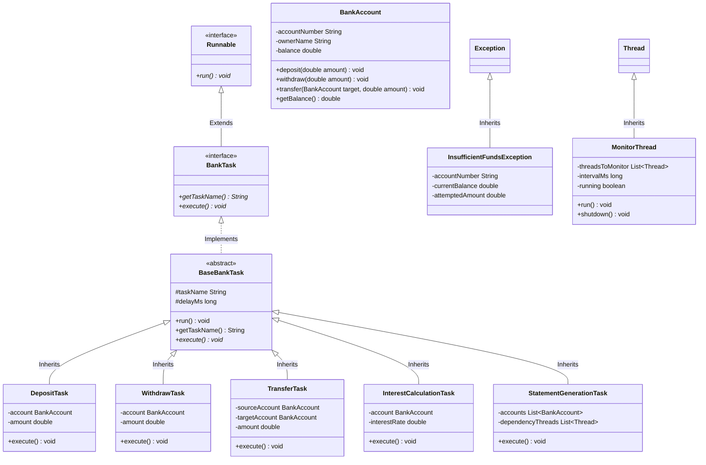

# Multithreaded Banking System Task Management Framework

This project is a complete Java implementation of a generic multithreaded task management framework designed for a **Banking System**. It satisfies all 12 evaluation criteria specified in the mini-project assignment.

---

## 1. Project Architecture & Requirements Alignment

Here is how each assignment requirement is implemented in this codebase:

| Req # | Requirement Name | Implementation in Code |
|---|---|---|
| **1** | **Object-Oriented Design** | Demonstrates classes & objects (`BankAccount`, tasks), encapsulation (private fields + getters in `BankAccount`), inheritance (`BaseBankTask` extends object and is subclassed), interfaces (`BankTask`), and runtime polymorphism (`BankTask` references calling overridden `execute()` methods). |
| **2** | **Runnable-Based Task Design** | `BankTask` extends `Runnable`. Concrete task implementations include `DepositTask`, `WithdrawTask`, `TransferTask`, `InterestCalculationTask`, and `StatementGenerationTask`. |
| **3** | **Multiple Threads** | Spawns and executes 6 concurrent threads (`Thread-1` to `Thread-6`) managing deposits, withdrawals, transfers, interest application, and statements. |
| **4** | **Thread Life Cycle** | Inspects and displays thread states via `Thread.getState()`. Captures `NEW` before starting, `RUNNABLE`/`TIMED_WAITING` during execution, `WAITING` during joins, and `TERMINATED` at completion. |
| **5** | **Thread Naming** | Assigns distinct descriptive names using `setName()` and queries them using `getName()`. |
| **6** | **Thread Priorities** | Assigns `Thread.MAX_PRIORITY` (deposits/withdrawals), `Thread.NORM_PRIORITY` (transfers/statements), and `Thread.MIN_PRIORITY` (background interest). The main class includes a discussion of observed JVM scheduling behavior. |
| **7** | **Sleep Method** | Uses `Thread.sleep()` in `BaseBankTask` to simulate latency and database transaction times, forcing threads to yield execution. |
| **8** | **Join Method** | `StatementGenerationTask` uses `thread.join()` to wait for all transaction threads to complete before generating the final report. The main thread joins the statement thread. |
| **9** | **Shared Resource** | `BankAccount` instances are shared resources accessed concurrently by multiple threads. |
| **10** | **Synchronization** | Avoids race conditions and corrupt balances by using `synchronized` methods. Prevents deadlock during transfer operations via a strict lock-ordering strategy. |
| **11** | **Exception Handling** | Employs try-catch-finally blocks, handles `InterruptedException`, and throws/catches a user-defined custom exception (`InsufficientFundsException`). |
| **12** | **Monitoring Thread** | Implements `MonitorThread` which runs periodically to output Name, State, and Priority of all active threads. |

---

## 2. UML / Class Diagram

The framework structure is illustrated below:



---

## 3. Compilation and Execution

A batch script is provided to compile and run the project automatically.

### Running via command prompt:
1. Open Command Prompt (`cmd`) or PowerShell.
2. Navigate to the project root directory:
   ```cmd
   cd C:\Users\shaho\.gemini\antigravity\scratch\banking-task-framework
   ```
3. Run the compilation batch script:
   ```cmd
   .\compile_and_run.bat
   ```

---

## 4. Key Screenshots to Capture for Your Report

To achieve a perfect score on this project, take screenshots at the following key points of execution (marked in the console output):

1. **Screenshot 1: Startup & NEW State**
   * *What to show:* The initial account balances and the print statements showing the `NEW` thread states before `start()` is invoked.
   * *Report Section:* *Thread Life Cycle (NEW State) / Introduction*.

2. **Screenshot 2: Concurrent Execution & Monitor Thread Output**
   * *What to show:* The tabular output printed by the `System-Monitor-Thread`. Focus on where it lists the threads, their priority (1, 5, 10), and their running states (e.g. `RUNNABLE`, `TIMED_WAITING`).
   * *Report Section:* *Monitoring Thread / Thread Priorities*.

3. **Screenshot 3: Thread WAITING State**
   * *What to show:* The line where `Statement-Gen-Thread-6` enters the `WAITING` state because it is calling `join()` on the transaction threads, and the subsequent check from `[Main]` confirming its state is `WAITING`.
   * *Report Section:* *Thread Life Cycle (WAITING State) / Thread Joins*.

4. **Screenshot 4: Synchronization & Custom Exception handling**
   * *What to show:* The error print statement starting with `[Alice-Overdraft-Thread-4] !!! Exception caught...` demonstrating the custom `InsufficientFundsException` being caught, and the successful transfers/deposits proving that the shared resource (`BankAccount`) is protected.
   * *Report Section:* *Exception Handling / Synchronization*.

5. **Screenshot 5: Final Balanced State & TERMINATED State**
   * *What to show:* The final consolidated banking statement showing correct balance numbers (matching mathematical expectation) followed by the prints confirming threads are in the `TERMINATED` state.
   * *Report Section:* *UML Verification / Conclusion*.
